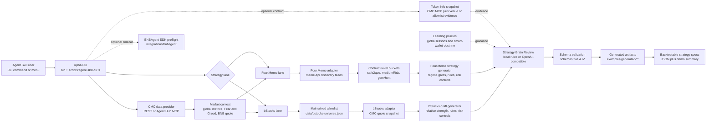

# 4lpha Agent Skills

Agent skills and a companion CLI for generating backtestable BNB Chain strategy specifications from live market context and lane-specific signals.

4lpha focuses on two strategy lanes:

- **Four.Meme** - BNB meme-token discovery with CMC market regime gates, Four.Meme venue filters, and advisory smart-wallet doctrine.
- **bStocks** - tokenized-stock rotation on BNB Chain with a maintained bStocks allowlist, CMC quote data, and relative-strength rules.

The output is not a trade execution command. Each run produces machine-readable strategy artifacts with explicit universe, entry rules, exit rules, risk controls, invalidation conditions, evidence, assumptions, timestamps, and review verdicts.

## AI Integration

Install as Agent Skills so Codex, Claude Code, and other Open Agent Skills-compatible tools can discover the workflows:

```powershell
npx --yes skills add kann420/4lpha-agent-skills
```

Or install the CLI only:

```powershell
npm install -g github:kann420/4lpha-agent-skills
```

Then launch the interactive CLI:

```powershell
4lpha menu
```

## Features

- **Agent Skills** - Ships `fourmeme-strategy-skill` and `bstocks-strategy-skill` as installable Open Agent Skills-compatible workflows.
- **Live CMC Market Context** - Fetches CoinMarketCap global metrics, Fear & Greed, and BNB quote data through direct REST or Agent Hub MCP transport.
- **Four.Meme Discovery** - Scans live Four.Meme feeds, normalizes contract-level candidates, and applies Safe 2 Ape, Medium Risk, and Gem Hunt filters.
- **bStocks Rotation** - Maintains a separate bStocks allowlist and ranks quoteable instruments by CMC-backed relative strength and activity.
- **Strategy Brain Review** - Applies deterministic local review by default, with optional OpenAI-compatible LLM review for single-agent or multi-agent modes.
- **Schema Validation** - Validates Four.Meme, bStocks draft, bStocks reviewed, and token-info artifacts against committed JSON schemas.
- **Token Info Snapshots** - Fetches contract-level Four.Meme or bStocks evidence for focused strategy review.
- **BNBAgent SDK Preflight** - Includes an official BNBAgent SDK dry-run path for ERC-8004 identity integration without broadcasting transactions.

## Quick Start

```powershell
# Install the agent skills for Codex / Claude Code-compatible environments
npx --yes skills add kann420/4lpha-agent-skills

# Install the CLI from GitHub
npm install -g github:kann420/4lpha-agent-skills

# Provide a CMC key in the current shell, or let the CLI prompt interactively
$env:CMC_API_KEY="your-cmc-api-key"

# Open the interactive launcher
4lpha menu

# Generate a Four.Meme strategy bundle using CMC Agent Hub MCP
4lpha demo --cmc-provider agent-hub-mcp

# Generate a bStocks strategy bundle using CMC Agent Hub MCP
4lpha demo --lane bstocks --cmc-provider agent-hub-mcp

# Run BNBAgent SDK preflight without broadcasting a transaction
4lpha bnbagent dry-run --debug
```

For one-off execution without a global install:

```powershell
npm exec --yes --package=github:kann420/4lpha-agent-skills 4lpha -- demo --cmc-provider agent-hub-mcp
```

## Architecture



## Configuration

Copy `.env.example` to `.env.local` and set local-only credentials there. Do not commit real API keys, private keys, wallet material, RPC credentials, cookies, JWTs, or signed payloads.

Common settings:

```env
CMC_API_KEY=your-cmc-api-key
CMC_DATA_PROVIDER=agent-hub-mcp

# Optional: only needed when using an LLM-backed brain
LLM_API_KEY=your-llm-api-key
```

Brain review settings:

- The default brain is `multi-agent` with `local-rules`, which means deterministic built-in reviewers and no LLM API key.
- `multi-agent` runs a small review committee before the final strategy is accepted or rejected. Four.Meme uses Safety, Social, and Gatekeeper roles. bStocks uses Safety, Market Analysis, and Gatekeeper roles.
- `LLM_API_KEY` is optional. Set it only if you switch the brain provider to `openai-compatible` for LLM-backed single-agent or multi-agent decisions.

Example LLM-backed run:

```powershell
4lpha demo --brain-provider openai-compatible
```

## Project Layout

```text
data/                         Maintained lane inputs and learning policies
docs/                         Architecture, tooling, and strategy notes
examples/                     Generated strategy and snapshot artifacts
integrations/bnbagent/        Official BNBAgent SDK integration layer
schemas/                      JSON schemas for strategy and token-info outputs
scripts/                      CLI entrypoints and generation helpers
skills/                       Installable agent skill definitions
src/                          Adapters, strategy generators, review logic, validators
tests/                        Focused smoke tests
```

## Output Artifacts

Strategy generation writes reproducible artifacts under `examples/generated/` or the requested artifacts directory:

- `cmc-market-context.snapshot.json`
- `fourmeme-discovery.snapshot.json`
- `cmc-market-regime.strategy.json`
- `bstocks-universe.snapshot.json`
- `bstocks-draft.strategy.json`
- `bstocks-reviewed.strategy.json`
- `demo.summary.md`

The strategy status can be `proposed` or `rejected`. A rejected strategy is still a valid backtestable output when current market data fails the activation gates.

## Verification

```powershell
npm run typecheck
npm run test:fourmeme-brain
npm run test:bstocks-brain
npm run test:token-info
npm run check
```
