# 4lpha Agent Skills

Agent skills and a companion CLI for generating backtestable BNB Chain strategy specifications from live market context and lane-specific signals.

4lpha focuses on two strategy lanes:

- **Four.Meme** - BNB meme-token discovery with CMC market regime gates, Four.Meme venue filters, and advisory smart-wallet doctrine.
- **bStocks** - tokenized-stock rotation on BNB Chain with a maintained bStocks allowlist, CMC quote data, and relative-strength rules.

The output is not a trade execution command. Each run produces machine-readable strategy artifacts with explicit universe, entry rules, exit rules, risk controls, invalidation conditions, evidence, assumptions, timestamps, and review verdicts.

## AI Integration

Install as Agent Skills so Codex, Claude Code, and other Open Agent Skills-compatible tools can discover the workflows:

```powershell
npx --yes skills add kann420/4lpha-agent-skills
```

Or install the CLI only:

```powershell
npm install -g github:kann420/4lpha-agent-skills
```

Then launch the interactive CLI:

```powershell
4lpha menu
```

## Architecture

```mermaid
flowchart LR
  caller["Agent Skill user<br/>CLI command or menu"] --> cli["4lpha CLI<br/>bin + scripts/agent-skill-cli.ts"]
  cli --> skillRoute["Marketplace-ready routing<br/>local find_skill contract"]
  cli --> provider["CMC data provider<br/>REST or Agent Hub MCP"]
  provider --> market["Market context<br/>global metrics, Fear and Greed, BNB quote, technicals"]
  cli --> lane{"Strategy lane"}

  skillRoute --> lane
  lane --> fourmeme["Four.Meme lane"]
  market --> fourmeme
  fourmeme --> fourmemeFeeds["Four.Meme adapter<br/>meme-api discovery feeds"]
  fourmemeFeeds --> buckets["Contract-level buckets<br/>safe2ape, mediumRisk, gemHunt"]
  buckets -. optional shortlist .-> onchain["Optional on-chain enrichment<br/>recorded fixture or proof-gated remote"]
  buckets --> fourmemeSpec["Four.Meme strategy generator<br/>regime gates, rules, risk controls"]
  onchain -. evidence .-> fourmemeSpec

  lane --> bstocks["bStocks lane"]
  market --> bstocks
  bstocks --> allowlist["Maintained allowlist<br/>data/bstocks-universe.json"]
  allowlist --> quotes["bStocks adapter<br/>CMC quote snapshot"]
  quotes --> bstocksDraft["bStocks draft generator<br/>relative strength, rules, risk controls"]

  cli -. optional contract .-> tokenInfo["Token info snapshot<br/>CMC MCP plus venue or allowlist evidence"]
  tokenInfo -. evidence .-> brain["Strategy Brain Review<br/>local rules or OpenAI-compatible"]
  learning["Learning policies<br/>global lessons and smart-wallet doctrine"] -. guidance .-> brain
  fourmemeSpec --> brain
  bstocksDraft --> brain

  brain --> validate["Schema validation<br/>schemas/ via AJV"]
  validate --> artifacts["Generated artifacts<br/>examples/generated/**"]
  artifacts --> replay["Replay and readiness gates<br/>fixture pack, schema checks, empirical appendix"]
  replay --> output["Backtestable strategy specs<br/>JSON plus demo summary"]

  cli -. optional sidecar .-> bnbagent["BNBAgent SDK preflight<br/>integrations/bnbagent"]
```



## Features

- **Agent Skills** - Ships `fourmeme-strategy-skill` and `bstocks-strategy-skill` as installable Open Agent Skills-compatible workflows.
- **Live CMC Market Context** - Fetches CoinMarketCap global metrics, Fear & Greed, and BNB quote data through direct REST or Agent Hub MCP transport.
- **CMC Technical Evidence** - Attaches BNB technical-analysis signals from the Agent Hub MCP path when available, while preserving partial-tool failures in `dataQuality`.
- **Skills Marketplace Routing** - Ships a local, marketplace-ready `find_skill`-style routing contract and `skill:route` command that select the right primary strategy skill, route context-only requests, and reject unrelated queries.
- **Curated On-Chain Skill Enrichment** - Adds fixture-backed Four.Meme enrichment for `score_holder_concentration_risk`, `review_dex_wallet_activity_profile`, and `review_dex_wallet_pnl`; holder concentration is a hard gate, wallet activity is entry quality, and wallet PnL is advisory only.
- **Optional Remote Proof Gates** - Adds strict import/live validators for real CMC `find_skill` plus on-chain skill execution proof bundles; fixture output cannot pass the remote-proof gate.
- **Four.Meme Discovery** - Scans live Four.Meme feeds, normalizes contract-level candidates, and applies Safe 2 Ape, Medium Risk, and Gem Hunt filters.
- **Optional Empirical Replay Path** - Captures real Four.Meme plus CMC snapshots after setup, replays strategy selection against baselines, and reports PnL metrics only when enough forward observations exist.
- **bStocks Rotation** - Maintains a separate bStocks allowlist and ranks quoteable instruments by CMC-backed relative strength and activity.
- **Strategy Brain Review** - Applies deterministic local review by default, with optional OpenAI-compatible LLM review for single-agent or multi-agent modes.
- **Schema Validation** - Validates Four.Meme, bStocks draft, bStocks reviewed, and token-info artifacts against committed JSON schemas.
- **Token Info Snapshots** - Fetches contract-level Four.Meme or bStocks evidence for focused strategy review.
- **BNBAgent SDK Preflight** - Includes an official BNBAgent SDK dry-run path for ERC-8004 identity integration without broadcasting transactions.
- **Reproducible Offline Replay** - Ships a clearly marked Four.Meme `proposed` fixture plus a replay/baseline summary that runs without live secrets.

## Why This Wins Track 2

4lpha is built for the Strategy Skills lane: it turns CMC market context into explicit, schema-validated strategy specs rather than trade commands. The main Four.Meme path combines Agent Hub MCP market data, BNB technical-analysis evidence, marketplace-ready routing, live venue discovery, contract-level identity, deterministic review agents, optional proof-gated on-chain enrichment, and replayable artifact hashes so reviewers can inspect exactly what data produced each rule.

The live demo can reject weak regimes, which is intentional risk discipline. The committed `examples/generated/fourmeme-proposed/` fixture shows the same pipeline under a supportive regime, and `examples/replay/` compares strategy selection against a simple volume-only baseline without claiming profitability.

## What Is Live, Fixture, And Local

- `agent-hub-mcp` market context is live CMC Agent Hub MCP data when a local CMC key is configured.
- `skillRoute.skillExecution.mode: local-contract` means the repo used a marketplace-ready routing contract; it is not a remote CMC Skills endpoint result.
- `onchainEnrichment.skillExecution.mode: recorded` means the proposed fixture records the expected CMC on-chain skill output shape for replay; it is not a live on-chain call.
- `skillExecution.mode: recorded-remote` means a sanitized and hashed transcript from real CMC remote/UI/API/agent output was imported.
- `skillExecution.mode: live-execution` means a configured remote endpoint returned a validated CMC skill execution proof at runtime.
- `CMC_SKILL_MARKETPLACE_ENDPOINT` is not the CMC MCP URL. Leave it blank unless you have a real remote CMC Skills execution endpoint that can run or return skill execution proofs.
- `https://mcp.coinmarketcap.com/mcp` belongs to the CMC Agent Hub MCP transport used for market data; it is configured through the MCP provider path and `CMC_API_KEY` or `CMC_MCP_API_KEY`.
- `npm run skill:probe` reports whether `CMC_SKILL_MARKETPLACE_ENDPOINT` is configured. Without that env var, it prints `status: unavailable` and keeps the demo honest.
- `npm run validate:cmc-skill-proof` fails unless the proof bundle is `recorded-remote` or `live-execution` and includes all three on-chain skills.

## Quick Start

```powershell
# Install the agent skills for Codex / Claude Code-compatible environments
npx --yes skills add kann420/4lpha-agent-skills

# Install the CLI from GitHub
npm install -g github:kann420/4lpha-agent-skills

# Provide a CMC key in the current shell, or let the CLI prompt interactively
$env:CMC_API_KEY="your-cmc-api-key"

# Open the interactive launcher
4lpha menu

# Generate a Four.Meme strategy bundle using CMC Agent Hub MCP
4lpha demo --cmc-provider agent-hub-mcp

# Two-command demo flow
npm run judge:live
npm run judge:replay

# Strict empirical appendix once real CMC proof and real snapshots exist
npm run judge:empirical

# Show the curated find_skill-style route for a Four.Meme query
npm run skill:route -- --query "Generate a Four.Meme BNB meme-token strategy with holder concentration checks"

# Generate a bStocks strategy bundle using CMC Agent Hub MCP
4lpha demo --lane bstocks --cmc-provider agent-hub-mcp

# Run BNBAgent SDK preflight without broadcasting a transaction
4lpha bnbagent dry-run --debug
```

For one-off execution without a global install:

```powershell
npm exec --yes --package=github:kann420/4lpha-agent-skills 4lpha -- demo --cmc-provider agent-hub-mcp
```

## Configuration

Copy `.env.example` to `.env.local` and set local-only credentials there. Do not commit real API keys, private keys, wallet material, RPC credentials, cookies, JWTs, or signed payloads.

Common settings:

```env
CMC_API_KEY=your-cmc-api-key
CMC_MCP_API_KEY=
CMC_DATA_PROVIDER=agent-hub-mcp

# Optional proof-only path. Leave blank unless you have a real remote CMC Skills execution endpoint.
CMC_SKILL_MARKETPLACE_ENDPOINT=
CMC_SKILL_MARKETPLACE_API_KEY=

# Optional: only needed when using an LLM-backed brain
LLM_API_KEY=your-llm-api-key
```

Brain review settings:

- The default brain is `multi-agent` with `local-rules`, which means deterministic built-in reviewers and no LLM API key.
- `multi-agent` runs a small review committee before the final strategy is accepted or rejected. Four.Meme uses Safety, Social, and Gatekeeper roles. bStocks uses Safety, Market Analysis, and Gatekeeper roles.
- `LLM_API_KEY` is optional. Set it only if you switch the brain provider to `openai-compatible` for LLM-backed single-agent or multi-agent decisions.

Example LLM-backed run:

```powershell
4lpha demo --brain-provider openai-compatible
```

## Project Layout

```text
data/                         Maintained lane inputs and learning policies
docs/                         Architecture, tooling, and strategy notes
examples/                     Generated strategy and snapshot artifacts
integrations/bnbagent/        Official BNBAgent SDK integration layer
schemas/                      JSON schemas for strategy and token-info outputs
scripts/                      CLI entrypoints and generation helpers
skills/                       Installable agent skill definitions
src/                          Adapters, strategy generators, review logic, validators
tests/                        Focused smoke tests
```

## Output Artifacts

Strategy generation writes reproducible artifacts under `examples/generated/` or the requested artifacts directory:

- `cmc-market-context.snapshot.json`
- `fourmeme-discovery.snapshot.json`
- `skill-route.snapshot.json`
- `fourmeme-onchain-enrichment.snapshot.json` in the offline proposed fixture
- `cmc-market-regime.strategy.json`
- `bstocks-universe.snapshot.json`
- `bstocks-draft.strategy.json`
- `bstocks-reviewed.strategy.json`
- `demo.summary.md`

The strategy status can be `proposed` or `rejected`. A rejected strategy is still a valid backtestable output when current market data fails the activation gates.

Committed reproducible offline evidence:

- `examples/generated/fourmeme-proposed/` - deterministic Four.Meme supportive-regime fixture with `status: proposed`
- `examples/generated/fourmeme-proposed/fourmeme-onchain-enrichment.snapshot.json` - deterministic CMC on-chain skill-shape enrichment fixture for the shortlisted contracts
- `examples/replay/fourmeme-fixture-replay.summary.md` - fixture replay against a volume-only baseline
- `examples/replay-pack/fourmeme/snapshots.json` - pinned 10-snapshot replay pack for methodology evidence
- `examples/replay/fourmeme-pack-replay.summary.md` - replay-pack aggregate metrics and caveats

Optional empirical evidence, generated only after real proof/snapshot capture:

- `examples/proofs/cmc-skills/fourmeme-onchain-proof.bundle.json` - sanitized CMC `find_skill` plus remote on-chain skill proof bundle
- `examples/real-snapshots/fourmeme/manifest.json` - real Four.Meme plus CMC capture manifest; strict replay requires at least 30 snapshots across 12 hours, while the recommended capture run collects 36 snapshots over about 18 hours for buffer
- `examples/replay/fourmeme-real-replay.summary.md` - real-snapshot strategy replay against volume-only, category-score-only, and no-onchain-filter baselines
- `examples/replay/fourmeme-real-backtest.summary.md` - forward-return backtest summary; PnL metrics appear only after at least 10 valid forward observations

## Verification

Offline baseline, no secrets required:

```powershell
npm run typecheck
npm run test:fourmeme-brain
npm run test:bstocks-brain
npm run test:token-info
npm run skill:route -- --plain
npm run skill:probe -- --plain
npm run replay:fourmeme-fixture
npm run replay:fourmeme-pack
npm run validate:examples
npm run validate:judge-readiness
npm run check
```

Demo helpers:

```powershell
npm run judge:live
npm run judge:replay
```

Strict empirical appendix, only after a real remote proof endpoint or imported `recorded-remote` transcript and enough real snapshots exist:

```powershell
npm run skill:proof:preflight -- --plain
npm run validate:cmc-skill-proof
npm run capture:fourmeme-real -- --count 36 --interval-minutes 30 --cmc-provider agent-hub-mcp
npm run replay:fourmeme-real
npm run backtest:fourmeme-real
npm run judge:empirical
```

`npm run check` remains the no-secret offline baseline. The strict empirical appendix is expected to fail until a real proof bundle and enough real snapshots have been captured.
